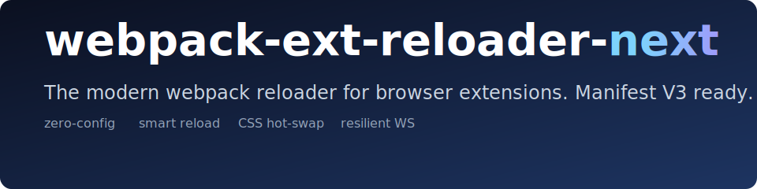

<p align="center">
  
</p>

<p align="center">
  <a href="https://www.npmjs.com/package/webpack-ext-reloader-next"></a>
  <a href="https://www.npmjs.com/package/webpack-ext-reloader-next"></a>
  <a href="https://github.com/graybearo/webpack-ext-reloader-next/actions/workflows/ci.yml"></a>
  <a href="LICENSE"></a>
</p>

<p align="center">
  
  
  
  
  
  
</p>

<p align="center">
  Auto-reloads your Chrome / Firefox / Edge extension while you edit. Built
  for <strong>Manifest V3</strong> from the ground up, with smart routing
  so a CSS edit doesn't reload your whole extension.
</p>

---

## Why this exists

The original `webpack-ext-reloader` is unmaintained and broken on Manifest
V3 — its WebSocket dies the moment Chrome puts the service worker to
sleep, and it doesn't reconnect. This package is the modern successor.

It picks a port, watches your build, and reloads the extension over a
self-healing WebSocket that survives service-worker eviction. No
configuration required for the common case.

## Install

```bash
pnpm add -D webpack-ext-reloader-next
# or: npm i -D webpack-ext-reloader-next
# or: yarn add -D webpack-ext-reloader-next
```

## Quick start

Drop one line into your webpack config. Pick the form that matches your
setup:

**CommonJS (`webpack.config.js` or `.cjs`):**

```js
const { ExtReloader } = require("webpack-ext-reloader-next");

module.exports = {
  mode: "development",
  // ...your config
  plugins: [new ExtReloader()],
};
```

**ES Modules (`webpack.config.mjs`, or with `"type": "module"`):**

```js
import { ExtReloader } from "webpack-ext-reloader-next";

export default {
  mode: "development",
  // ...your config
  plugins: [new ExtReloader()],
};
```

**TypeScript (`webpack.config.ts`):**

```ts
import { ExtReloader, type ExtReloaderOptions } from "webpack-ext-reloader-next";
import type { Configuration } from "webpack";

const config: Configuration = {
  mode: "development",
  // ...your config
  plugins: [new ExtReloader()],
};

export default config;
```

The default export is also available if you prefer
`import ExtReloader from "webpack-ext-reloader-next"`.

That's it. The plugin reads your `manifest.json`, infers your background
/ content / popup entries, and starts a reload server on a free port
starting at `9012`. Run `webpack --watch`, load the unpacked build into
Chrome, and edit a file — the extension reloads on its own.

> The plugin is automatically a no-op when `mode === "production"`.

<!-- assets/terminal.png — captured in Phase 2 once the WS server lands -->

## What it does on each kind of change

| You edited | What happens |
|------------|--------------|
| `manifest.json` | Full extension reload (`chrome.runtime.reload`) |
| `_locales/**` | Full extension reload |
| Background service worker | Full extension reload |
| Popup / options / devtools page | Reload the open extension page only |
| Content script JS | Reload tabs matching the script's `matches` |
| Content script or page CSS | **Hot-swap the `<link>` tag — no reload** |
| Static asset (image, etc.) | Nothing (just rebuild) |

The CSS hot-swap is the one feature no other webpack extension reloader
ships. You edit a content-script stylesheet, the matching `<link>` is
swapped out with a cache-buster, and your Gmail (or whatever) tab keeps
its scroll position and form state.

## Manifest V3 specifics

- **Service worker reconnection** — clients reconnect on every Chrome
  event so the WebSocket survives the SW eviction cycle.
- **No `eval`** — nothing in the injected client violates the MV3 CSP.
- **Smart keep-alive** — opt-in `chrome.alarms` ping so the SW never
  sleeps in dev (`keepAliveInDev: true`, on by default).
- **Cross-browser** — Chrome, Firefox, and Edge all supported via the
  `webextension-polyfill` types.

## Demo

<!-- assets/demo.gif — captured in Phase 6 once the reload pipeline is end-to-end -->

Three MV3 demo extensions live under [`packages/demo/`](packages/demo) —
one per target browser. They're identical except for the manifest:

- **[`packages/demo/chrome`](packages/demo/chrome)** — plain
  `background.service_worker`. Load via `chrome://extensions` →
  "Load unpacked" → `packages/demo/chrome/dist`.
- **[`packages/demo/edge`](packages/demo/edge)** — same manifest as Chrome.
  Load via `edge://extensions` → "Load unpacked" → `packages/demo/edge/dist`.
- **[`packages/demo/firefox`](packages/demo/firefox)** — `service_worker` +
  `scripts` fallback + `browser_specific_settings.gecko.id`. Load via
  `about:debugging#/runtime/this-firefox` → "Load Temporary Add-on" →
  `packages/demo/firefox/dist/manifest.json`.

```bash
git clone https://github.com/graybearo/webpack-ext-reloader-next
cd webpack-ext-reloader-next
pnpm install
pnpm --filter chrome-demo dev   # or firefox-demo / edge-demo
```

Firefox MV3 still gates `background.service_worker` behind the
`extensions.backgroundServiceWorker.enabled` pref, so any Firefox MV3
manifest also needs a `background.scripts` fallback — that's what the
firefox-demo shows.

## Standalone CLI (no webpack)

If you build with something other than webpack — esbuild, rollup, a custom
script — you can still use the same reload protocol via the CLI. It
watches your extension's output directory, classifies changes, and
broadcasts to clients you've added to your extension.

```bash
npx webpack-ext-reloader-next --dist ./dist
```

Options:

```text
-p, --port <number>     WebSocket port (default: auto from 9012)
    --manifest <path>   Path to manifest.json (default: probe in --dist)
-d, --dist <path>       Directory to watch (default: ./dist)
-h, --help              Show help
```

The CLI runs the same diff classifier as the webpack plugin, so reload
behavior is identical. You're responsible for getting the client scripts
into your extension build (see `packages/plugin/src/client/` for the
sources).

## OS notifications

Optional. If you `npm install node-notifier` (an `optionalDependency`),
the plugin fires OS-level notifications from the dev server, useful
when you're in another window and the build breaks:

- `'errors'` (default) — first error after a streak of successes, and
  on recovery.
- `'all'` — every reload + every error.
- `false` — disabled.

```js
new ExtReloader({ notifications: { osNotifications: "errors" } });
```

If `node-notifier` isn't installed (unavailable on some CI environments),
the plugin silently skips OS notifications. Everything else works
normally.

> We deliberately don't ship a `chrome.notifications` path. It would
> require consumers to add the `"notifications"` permission to their
> manifest just for a dev-time feature, which is poor practice. The
> action badge, in-page toast, and full-screen error overlay already
> cover browser-side feedback without permission pollution.

## Compared to alternatives

| Feature | this | `webpack-ext-reloader` | `@reorx/webpack-ext-reloader` | `webpack-extension-reloader-v3-manifest` |
|---|:---:|:---:|:---:|:---:|
| MV3 service worker reconnection | ✅ | ❌ | ⚠️ partial | ⚠️ partial |
| Smart routing (per-entry reload) | ✅ | ⚠️ basic | ⚠️ basic | ⚠️ basic |
| CSS hot-swap (no reload) | ✅ | ❌ | ❌ | ❌ |
| Build-error overlay | ✅ | ❌ | ❌ | ❌ |
| Zero-config | ✅ | ❌ | ❌ | ❌ |
| Last release | active | 2024 | 2023 | 2023 |

> Honest comparison, not marketing — these are all real plugins solving
> the same problem.

## Options

Every option is optional. The defaults work for most projects.

| Option | Type | Default | Notes |
|--------|------|---------|-------|
| `manifest` | `string` | auto | Path to manifest.json. Probes `./manifest.json`, `./src/manifest.json`, `./public/manifest.json`, `./static/manifest.json`. |
| `entries` | `object` | auto | Override entry detection. Shape: `{ background, contentScript, extensionPage }`. |
| `port` | `number` | `9012` | WebSocket port. Auto-increments if taken. |
| `maxRetries` | `number` | `50` | How many times the SW retries when the dev server is unreachable. `-1` = retry forever. Retries are silent (HTTP-probed before each WS attempt), so a high cap doesn't pollute the console. |
| `reloadPage` | `boolean` | `true` | Reload host tabs when content scripts change. |
| `keepAliveInDev` | `boolean` | `true` | Use `chrome.alarms` to keep the MV3 SW alive in dev. |
| `notifications.toast` | `boolean` | `true` | Show a small "reloaded" toast in host pages. |
| `notifications.errorOverlay` | `boolean` | `true` | Render a full-screen overlay on build errors. |
| `notifications.osNotifications` | `'all' \| 'errors' \| false` | `'errors'` | OS-level notifications. |
| `notifications.badge` | `boolean` | `true` | Color-code the extension's action badge by WS state. |
| `logLevel` | `'silent' \| 'normal' \| 'verbose'` | `'normal'` | Terminal output verbosity. |
| `force` | `boolean` | `false` | Run even when `mode === "production"`. |

## Roadmap

v0.1 ships everything below.

- [x] WebSocket server with auto-port selection (starts at 9012)
- [x] Resilient client with exponential-backoff reconnection
- [x] Auto-config: reads `manifest.json`, no entry mapping required
- [x] Smart reload classifier (manifest / background / page / tabs / CSS)
- [x] CSS hot-swap — no reload, no state loss
- [x] Build-error overlay in content scripts and pages
- [x] Reload toast on host pages
- [x] Action-badge state indicator (green / yellow / red)
- [x] Manifest watcher — picks up changes outside the webpack graph
- [x] Dual ESM + CJS + TypeScript webpack configs
- [x] OS notifications (`node-notifier` as an optional peer dep)
- [x] Standalone CLI (`npx webpack-ext-reloader-next`) for non-webpack toolchains

Future:

- [ ] Multi-compiler support
- [ ] rspack / vite plugin parity

## Contributing

PRs welcome. See [CONTRIBUTING.md](CONTRIBUTING.md) for setup, commit
conventions (we use Conventional Commits + semantic-release, so commit
type matters), and the code style.

## License

MIT — see [LICENSE](LICENSE).
